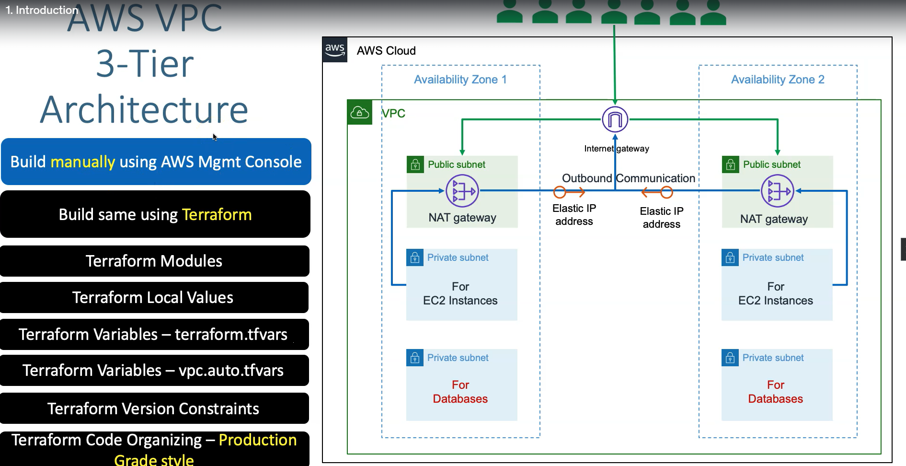

#AWS credentials configuration:
aws configure
provide credentials and to verify do "aws s3 ls"
cat $HOME/.aws/credentials - this will show the credentials we provided
------------------------------------------------------------------------------------------------------------------
#Terraform commands:
terraform init - used to initialize a working directory containing terrafom config files; downloads providers
terraform validate - validates the terraform configurations files to ensure they are syntatically valid
terraform plan - creates an execution plan; will show what is going to be applied in command line
terraform apply - applies the change required to reach the desired state of the configuration
terraform destroy - used to destroy the Terraform managed infrastructure; this will ask for confiration before destorying

First Project

Second Project

What are we going to learn?

Classic Load Balancer

Application Load Balancer

AWS ALB Context Path Based Routing

AWS ALB Host Header Based Routing

AWS ALB Custom Header Based Routing & Redirects with Query String and Host Header

AWS DNS to DB using Terraform

 Upgrade Terraform Modules
 

 AWS Autoscaling with Launch Configuration using Terraform
 

AWS Autoscaling with Launch Templates using Terraform

AWS Network Load Balancer with TCP & TLS Listeners using Terrafom

AWS CloudWatch using Terraform

Build Terraform Modules Locally

Terraform State

Terraform Remote State Datasource

IaC DevOps On AWS

GitHub Repository Links
Course Main Repository: https://github.com/stacksimplify/terraform-on-aws-ec2

IAC DevOps Repository: https://github.com/stacksimplify/terraform-iacdevops-with-aws-codepipeline

Course Presentation: https://github.com/stacksimplify/terraform-on-aws-ec2/tree/main/presentation

